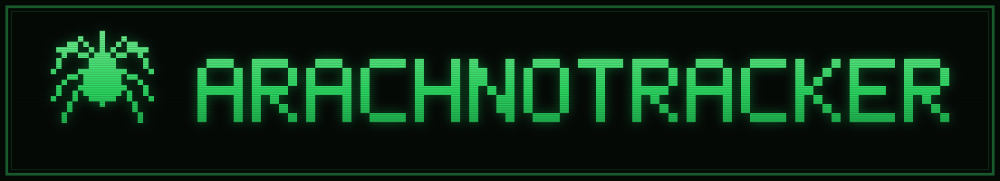
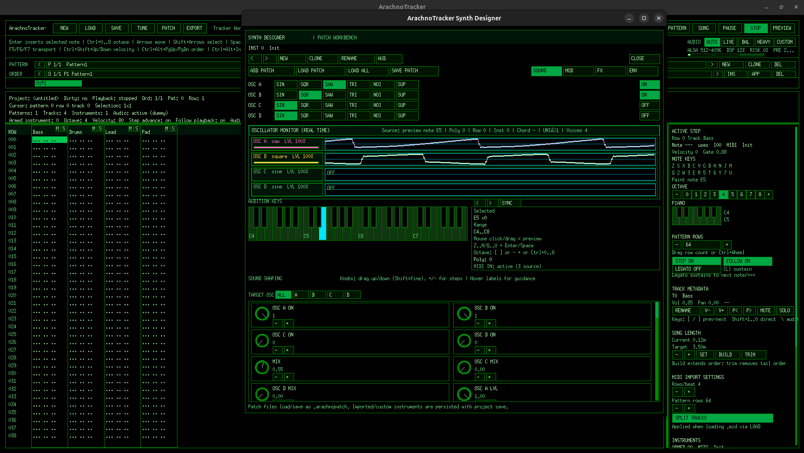

# ArachnoTracker

<p align="center">
  
</p>

ArachnoTracker is a Linux-first tracker workstation for darkwave/EBM production.
It combines:

- Pattern-based composition with per-step note-off (`===`) for releasing sustained notes
- A native synthesizer engine with full ADSR (amp + filter) envelopes per patch,
  portamento/glide, and a Freeverb-class comb/allpass reverb with proper FX tails
  - Layered instrument realism: per-oscillator frequency ratios and decay layers
    (piano/EP clang over a ringing body), velocity/key-scaled note ring, and true
    1:1 filter keyboard tracking — clean patches stay clean (no blanket saturation)
- Classic synthesized string patches (Vintage Strings, Synth Strings 85, Analog String Machine)
- A 98-patch factory library organized by category (`patches/factory/bass|drums|keys|lead|pads|strings|arps|fx`)
- A curated 128-preset General MIDI bank (`patches/gm/`) tuned for 80s/90s synth character;
  imported `.mid` files are voiced from it automatically (FM electric pianos, Juno-style
  ensemble strings/pads, analog mono basses with glide)
- MIDI import/export
- Realtime audition and playback
  - Dedicated audio producer thread (playback rendering never competes with UI redraws)
  - Lock-free playback snapshots: GUI polling (playhead, telemetry, MIDI) never
    blocks behind a producer block render
  - AUTO/LIVE/BALANCED/HEAVY/CUSTOM output modes trade latency vs. buffering robustness
  - Adaptive ALSA device buffering: 20 ms live default that self-escalates
    (20→48→96 ms) only on measured underrun streaks, so bursty PipeWire/Bluetooth
    sinks stop crackling without penalizing wired/live monitoring
  - Sustain-while-held live play from the computer keyboard and external MIDI controllers (ALSA)
- Offline render (WAV, MP3, OGG)
- Python composition SDK

## Screenshot

<p align="center">
  
</p>

## Build

Requirements:

- CMake (3.15+)
- C++17 compiler
- X11 development libraries
- `pthread` support
- Optional: ALSA development libraries (`libasound`) for native ALSA integration
- Optional: `ffmpeg` or `avconv` for MP3/OGG export

Build commands:

```bash
cmake -S . -B build
cmake --build build -j8
```

## Run

Default frontend entrypoint:

```bash
./build/ArachnoTracker
```

Frontend selection:

```bash
./build/ArachnoTracker --gui [project.arachno]
./build/ArachnoTracker --gui-window [project.arachno]
./build/ArachnoTracker --gui-shell [project.arachno]
```

Helpful CLI:

```bash
./build/ArachnoTracker --help
./build/ArachnoTracker --project-info project.arachno
./build/ArachnoTracker --validate project.arachno
./build/ArachnoTracker --actions
./build/ArachnoTracker --shortcuts
```

## Live Play and Note-Off

- In the pattern grid, tracker note keys write notes; `Caps Lock` writes a
  note-off step (rendered as `===`) that releases the last note on that track
  through its ADSR release phase.
- Octave numbers are absolute and consistent everywhere: octave `4` means
  middle-C territory (`C4` = MIDI 60) in the sidebar piano, the octave buttons,
  computer-keyboard note entry, and the synth designer keyboard.
- **Legato input** (`L` key or the sidebar `LEGATO` toggle): entered notes
  automatically sustain (gate) until the next note or `===` step on the same
  track — no manual gate editing needed for held pads/basslines. Sustained
  notes show a slim marker bar in the grid rows they ring through.
- In the synth patch designer, holding a computer-keyboard note key sustains
  the note at its envelope sustain level; releasing the key starts the release
  phase — just like classic hardware.
- External MIDI controllers (ALSA sequencer input) play the armed instrument
  from anywhere in the app: NoteOn sustains, NoteOff releases. Set
  `ARACHNO_MIDI_INPUT=client:port` to pick a specific source.
- Every patch exposes amp and filter ADSR (attack/decay/sustain/release) in the
  synth designer, in `.arachnopatch` files, and via the Python SDK.

## Patch Browser UX

- The patch file browser navigates the category folders under `patches/factory/`;
  directories open with a single click or `Enter`.
- **Double-click** a patch file to load it immediately (same as APPLY/Enter).
- **Up/Down** (and PageUp/PageDown/Home/End) move through the list; the
  highlighted patch is auditioned instantly as the selection moves.
- The browser **remembers the last used patch folder** across sessions
  (stored in `$XDG_CONFIG_HOME/arachnotracker/settings.txt` or
  `~/.config/arachnotracker/settings.txt`).
- In the synth designer, **Left/Right or Up/Down** cycle instruments.
- Patches can also be loaded without leaving the pattern editor: the sidebar
  INSTRUMENTS section has **LOAD PATCH** (replace the armed instrument) and
  **ADD PATCH** (import as a new instrument and arm it) buttons.
- Loading a `.mid`/`.midi` file via **LOAD** imports it as a new project using
  the sidebar MIDI import settings (rows/beat, pattern rows, track split).

## Render and Exchange

Render full mix:

```bash
./build/ArachnoTracker --render project.arachno output.wav
./build/ArachnoTracker --render project.arachno output.mp3
./build/ArachnoTracker --render project.arachno output.ogg
```

Render stems:

```bash
./build/ArachnoTracker --render-stems project.arachno stems wav
```

MIDI:

```bash
./build/ArachnoTracker --import-midi input.mid output.arachno [rows-per-beat] [pattern-rows]
./build/ArachnoTracker --export-midi project.arachno output.mid
```

Patch I/O:

```bash
./build/ArachnoTracker --export-patch project.arachno 1 patch.arachnopatch
./build/ArachnoTracker --import-patch in.arachno out.arachno patch.arachnopatch [name]
./build/ArachnoTracker --replace-patch in.arachno out.arachno 1 patch.arachnopatch [name]
./build/ArachnoTracker --write-gm-presets patches/gm   # regenerate the 128-preset GM bank
```

## Typical Composition Flow

1. Create/load project.
2. Build instruments/patches.
3. Program patterns and per-cell effects.
4. Arrange order list for full song structure.
5. Audition pattern vs full song playback.
6. Export final mix/stems/MIDI.

## Tests

```bash
ctest --test-dir build --output-on-failure
timeout 120s ./build/arachno_smoke_tests   # assert-based smoke suite (needs ~60s)
PYTHONPATH=python python3 -m unittest discover -s python/tests
```

## Diagnostics

- Top-panel telemetry shows the producer state (`P-THR`/`P-GUI`), queue-health
  counters (`s`=starvation, `c`=congestion, `x`=device xruns), queue fill, and
  the ALSA device latency when escalated (`AL<n>ms`).
- `ARACHNO_SPIKE_LOG=1 ./build/ArachnoTracker --gui 2>spikes.log` logs producer
  render and GUI-phase latency spikes with monotonic timestamps — the first
  thing to capture for any "random stutter" report.
- `ARACHNO_ALSA_LATENCY_MS=<5..250>` pins a fixed ALSA device buffer (disables
  the adaptive escalation).

## Documentation Map

- [docs/ARCHITECTURE.md](docs/ARCHITECTURE.md)
- [docs/LESSONS_LEARNED.md](docs/LESSONS_LEARNED.md)
- [src/audio/README.md](src/audio/README.md)
- [src/core/README.md](src/core/README.md)
- [src/ui/README.md](src/ui/README.md)
- [src/ui/gui/README.md](src/ui/gui/README.md)
- [python/arachnotracker/README.md](python/arachnotracker/README.md)
- [docs/PYTHON_API.md](docs/PYTHON_API.md)
